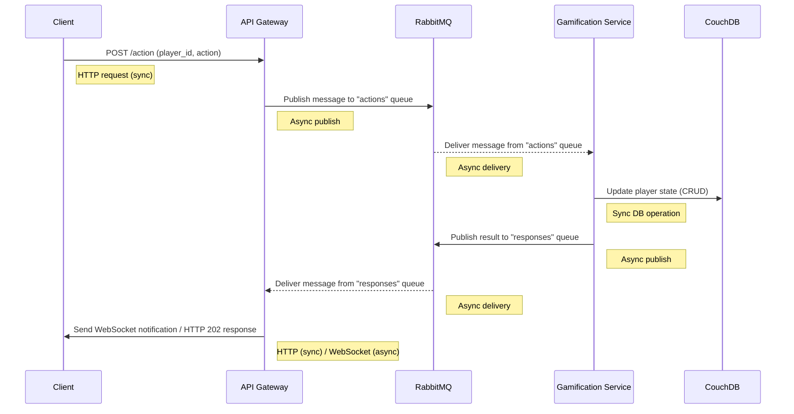

# Frajda Platform - Technical Overview

## System Flow
Frajda is designed as an asynchronous gamification engine. The core flow is:

1. **Client Action**: A client performs an action (e.g., "access archive") and sends an HTTP request to the `api_gateway`.
2. **Message Queue**: `api_gateway` publishes the action message to RabbitMQ.
3. **Gamification Service**: `gamification_service` consumes the message, evaluates it against the rules defined in `game_rules.yaml`, and determines rewards or achievements.
4. **Notification**: The service publishes the result to a response queue in RabbitMQ.
5. **Real-time Update**: `api_gateway` consumes messages from the response queue and emits notifications to connected clients via Socket.IO.

### Sequence Diagram


## Running with Docker
1. Ensure Docker and Docker Compose are installed.
2. Start all services using:
   ```
   docker-compose up --build
   ```
3. Services will start in order, waiting for dependencies to be healthy before continuing.

## Components

### api_gateway
- Exposes HTTP endpoint `/action` for client actions.
- Publishes action messages to RabbitMQ.
- Subscribes to response queue to emit real-time notifications over Socket.IO.
- Handles validation and logging.

### gamification_service
- Consumes actions from RabbitMQ.
- Evaluates rules defined in `game_rules.yaml`.
- Generates rewards or achievements.
- Publishes results back to RabbitMQ response queue.

### RabbitMQ
- Handles asynchronous message passing between `api_gateway` and `gamification_service`.
- Ensures decoupling and allows scalable, real-time message flow.

### CouchDB
- Stores player data and inventory.
- Gamification rules may query player state for evaluation.
- `db_initializer` ensures necessary databases are created on startup.

## Game Rules (`game_rules.yaml`)
- **Elements**: Define items in the game with rarity (common, rare, epic).
- **Rarity Probabilities**: Probabilities used for random reward generation.
- **Rewards**: Define reward types, values, and messages for players.
- **Helpers**: Small helper functions for rule evaluation (e.g., `has_item`, `has_rarity`).
- **Quests**: Define missions with rules and associated rewards.
- **Actions to Items Mapping**: Map player actions to specific in-game elements for evaluation.

## Creating a Simple Game with `game_rules.yaml`
1. Define elements your players can collect:
   - Example: `"coin"`, `"gem"`.
2. Define rewards for completing tasks:
   - Example: `"reward_10_coins"` gives 10 coins.
3. Write helper expressions:
   - Example: `has_item("coin", 5)` to check if player has 5 coins.
4. Create quests:
   - Example:
     ```
     - id: quest_collect_coins
       name: "Collect 5 Coins"
       description: "Gather 5 coins to earn a small reward."
       repeatable: true
       rule: "has_item('coin', 5)"
       reward: "reward_10_coins"
     ```
5. Map actions to elements:
   - Example: `"action_pick_coin": "coin"`.
6. Start the system, perform actions via `api_gateway`, and observe real-time notifications when quests are completed.

This setup allows building simple to complex gamification scenarios using declarative rules, asynchronous processing, and real-time client feedback.